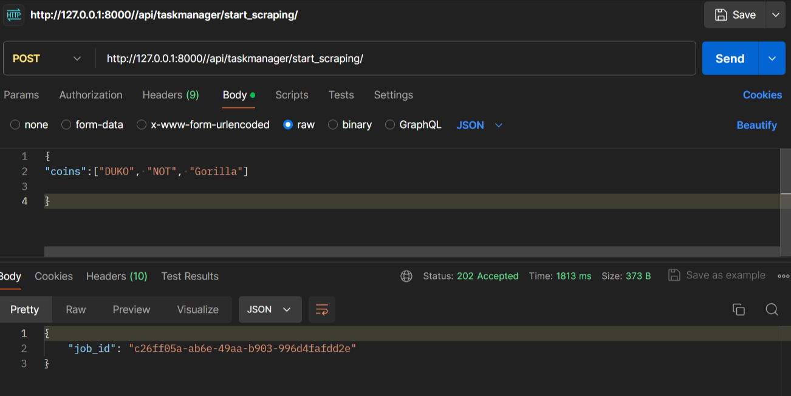
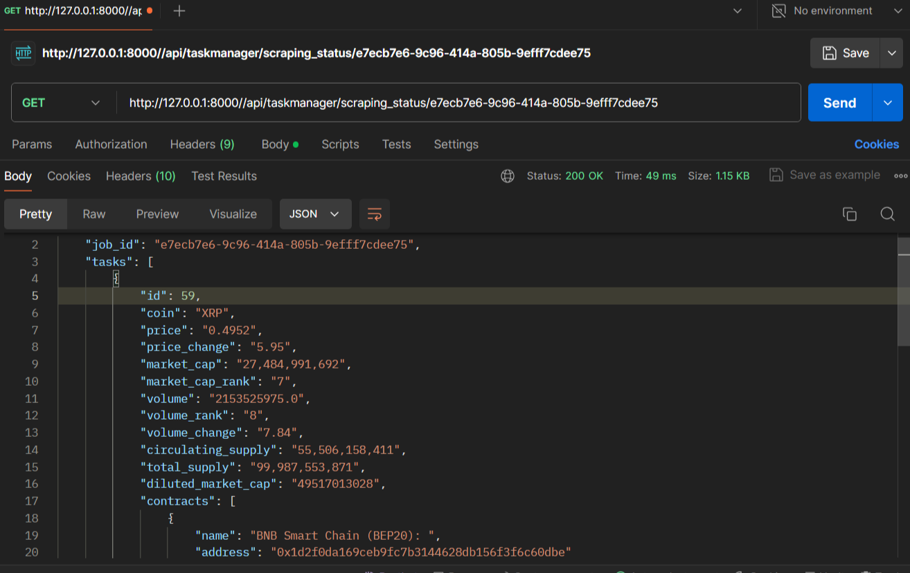

# Crypto Scraper

This project provides a web scraper for cryptocurrency data from CoinMarketCap. It allows users to start scraping data for specific cryptocurrencies and view the scraping status.

## Key Features

- **Input Crypto Coins**: Users can input the names of cryptocurrencies they want to scrape data for.
- **Parallel Scraping**: The scraping process is performed using Celery in parallel to improve efficiency.
- **Comprehensive Data**: Provides various data about the cryptocurrency, including price, price change, market cap, volume, and other relevant information.
- **Database Storage**: Scraped data is saved in the database for future reference and analysis.

## Installation


1. Clone the repository:


## Testing



<h2> API responses </h2>


<b>Input Crypto Coins</b> 
```json
{
"coins":["DUKO", "NOT", "Gorilla"]
}
```
<b>Job id Generated</b> 
```json
{
    "job_id": "e5ec9684-4ac5-4dbc-ae93-38cf01f6b37e"
}
```
<b>Comprehensive Data</b> 

```json
{
    "job_id": "e5ec9684-4ac5-4dbc-ae93-38cf01f6b37e",
    "tasks": [
        {
            "id": 49,
            "coin": "DUKO",
            "price": "0.004766",
            "price_change": "18.25",
            "market_cap": "46,057,761",
            "market_cap_rank": "662",
            "volume": "12405275.0",
            "volume_rank": "394",
            "volume_change": "26.93",
            "circulating_supply": "9,663,955,990",
            "total_supply": "9,999,609,598",
            "diluted_market_cap": "47657463",
            "contracts": [
                {
                    "name": "Solana: ",
                    "address": "HLptm5e6rTgh4EKgDpYFrnRHbjpkMyVdEeREEa2G7rf9"
                }
            ],
            "official_links": [
                {
                    "name": "Website",
                    "link": "https://dukocoin.com/"
                }
            ],
            "socials": [
                {
                    "name": "𝕏Twitter",
                    "link": "https://twitter.com/dukocoin"
                },
                {
                    "name": "Telegram",
                    "link": "https://t.me/+jlScZmFrQ8g2MDg8"
                }
            ]
        },
        {
            "coin": "NOT",
            "output": "-"
        },
        {
            "coin": "Gorilla",
            "output": "-"
        }
    ]
}
```

```json
{
"coins":["bitcoin","NOT","XRP"]

}
```

```json
{
    "job_id": "e7ecb7e6-9c96-414a-805b-9efff7cdee75",
    "tasks": [
        {
            "id": 59,
            "coin": "XRP",
            "price": "0.4952",
            "price_change": "5.95",
            "market_cap": "27,484,991,692",
            "market_cap_rank": "7",
            "volume": "2153525975.0",
            "volume_rank": "8",
            "volume_change": "7.84",
            "circulating_supply": "55,506,158,411",
            "total_supply": "99,987,553,871",
            "diluted_market_cap": "49517013028",
            "contracts": [
                {
                    "name": "BNB Smart Chain (BEP20): ",
                    "address": "0x1d2f0da169ceb9fc7b3144628db156f3f6c60dbe"
                }
            ],
            "official_links": [
                {
                    "name": "Website",
                    "link": "https://xrpl.org/"
                },
                {
                    "name": "Whitepaper",
                    "link": "https://ripple.com/files/ripple_consensus_whitepaper.pdf"
                },
                {
                    "name": "GitHub",
                    "link": "https://github.com/ripple/rippled"
                }
            ],
            "socials": [
                {
                    "name": "𝕏Twitter",
                    "link": "https://twitter.com/Ripple"
                },
                {
                    "name": "Reddit",
                    "link": "https://reddit.com/r/ripple"
                }
            ]
        },
        {
            "coin": "bitcoin",
            "output": "-"
        },
        {
            "coin": "NOT",
            "output": "-"
        }
    ]
}
```
## Table of Contents

- [Installation](#installation)
- [API Endpoints](#api-endpoints)
- [Database](#database)
- [Testing](#testing)

## Installation

1. Clone the repository:
git clone <https://github.com/RSahu20/crypto>

2. Navigate to the project directory:
   
```bash
crypto/
├── crypto/
│ ├── init.py
│ ├── settings.py
│ ├── celery.py
│ ├── urls.py
│ └── wsgi.py
├── scraper/
├── requirements.txt
└── manage.py

```

3. Install dependencies:
``` bash
pip install -r requirements.txt
```
4. Apply database migrations:
``` bash
python manage.py makemigrations
python manage.py migrate

```

## API Endpoints

List of API endpoints with brief descriptions, request methods, and example requests/responses.

| URL | Method    | Description                |
| :-------- | :------- | :------------------------- |
| `/api/taskmanager/start_scraping` | `POST` | **Initiates the scraping process for specific cryptocurrencies.** 
| `/api/taskmanager/scraping_status/<job_id>`      | `GET` | **Retrieves the status of the scraping process** |

|


## Database
Set up database for Mysql
``` bash
DATABASES = {
    'default': {
        'ENGINE': 'django.db.backends.mysql',
        'NAME': 'Database Name',
        'USER': 'root',
        'PASSWORD': 'PASSWORD',
        'HOST':'localhost,
        'PORT':'3306',
    }
}
```


